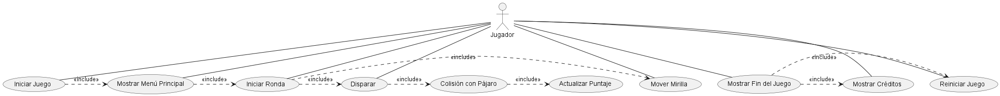
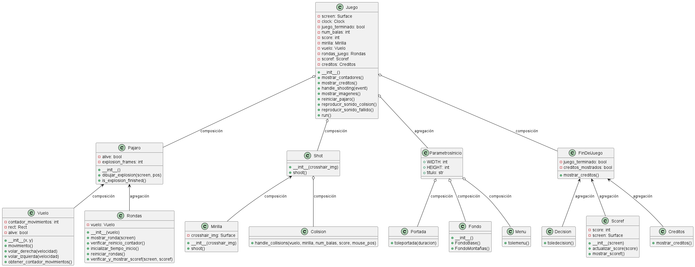
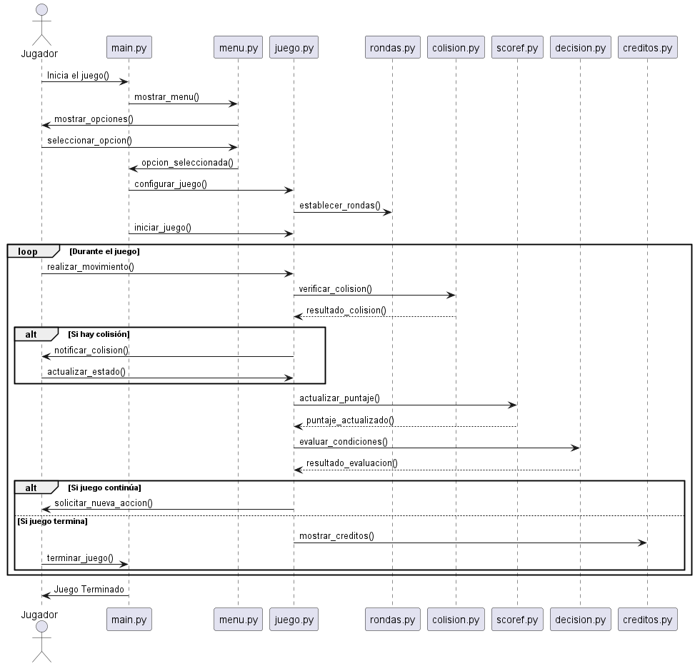

#Tole Hunt: Un Clásico Renacido

Hecho por:
    - María Juliana Alzate Saavedra - 20232020082
    - Erick Daniel Quiñones Galindo - 20232020074
    - Andres Felipe Chaparro Mosquera - 20231020140

¡Bienvenido a Tole Hunt, una reinterpretación moderna del clásico juego de caza de aves! Sumérgete en un entorno divertido y desafiante, donde tu objetivo es disparar a los pájaros en vuelo antes de que se escapen. Con gráficos únicos, efectos de sonido envolventes y una jugabilidad adictiva, Tole Hunt promete horas de diversión. ¡Coge tu escopeta, apunta y dispara!

Instrucciones: ¿Cómo Jugar?

Inicio del Juego:

Al iniciar el juego, se mostrará la portada. Presiona cualquier tecla para continuar al menú principal.

- Menú Principal:

    En el menú principal, selecciona "Iniciar Juego" para comenzar la partida.

- Control del Juego:

    - Movimiento de la Mirilla: Utiliza el ratón para mover la mirilla por la pantalla.
    - Disparo: Haz clic con el botón izquierdo del ratón para disparar. Tienes un total de 5 balas por ronda.

- Objetivo:

    Apunta a los pájaros en vuelo y dispara para derribarlos.
    Cada pájaro derribado te otorgará puntos.

- Contadores:

    - Balas: En la parte superior izquierda de la pantalla, se muestra el número de balas restantes.
    - Puntaje: Tu puntaje actual se muestra en la parte superior derecha de la pantalla.
    - Rondas:El juego se divide en rondas. Cada ronda se completa cuando el pájaro ha volado de un lado al otro de la pantalla 3 veces.
    Después de 3 movimientos completos del pájaro, se reinicia la ronda y el contador de movimientos.

- Colisiones y Efectos:

    Si aciertas a un pájaro, escucharás un sonido de colisión y verás una animación de explosión.
    Si fallas, se reproducirá un sonido de disparo fallido y perderás una bala.

- Fin del Juego:

    El juego termina cuando se acaban las balas. Se mostrará una pantalla de decisión donde puedes elegir entre continuar jugando o ver los créditos.
    Si decides continuar, el juego reiniciará y podrás seguir acumulando puntos.
    Si eliges ver los créditos, se mostrará la pantalla de créditos y luego el juego se cerrará.

- Pausas y Créditos:

    Durante el juego, puedes pausar para tomar una decisión sobre continuar o ver los créditos.
    ¡Prepárate para un viaje divertido en compañia de Tole con Tole Hunt! ¡Buena suerte y buena caza!

- A continuación puedes observar el diagrama de casos de uso de Tole Hunt:

- A continuación puedes observar el diagrama de clases de Tole Hunt:

- A continuación puedes observar el diagrama de secuencia de Tole Hunt:

